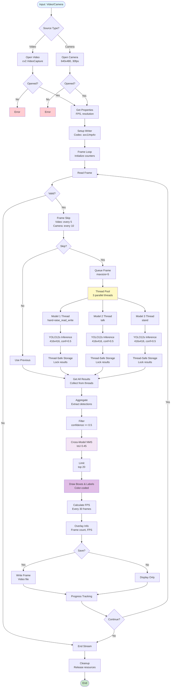

# Pipeline Xử Lý Video & Camera (Video Processing Pipeline)

## Cách sử dụng

Copy code Mermaid ở trên (từ `flowchart TD` đến `}`) và dán vào [mermaid.live](https://mermaid.live) để xem và chỉnh sửa.
